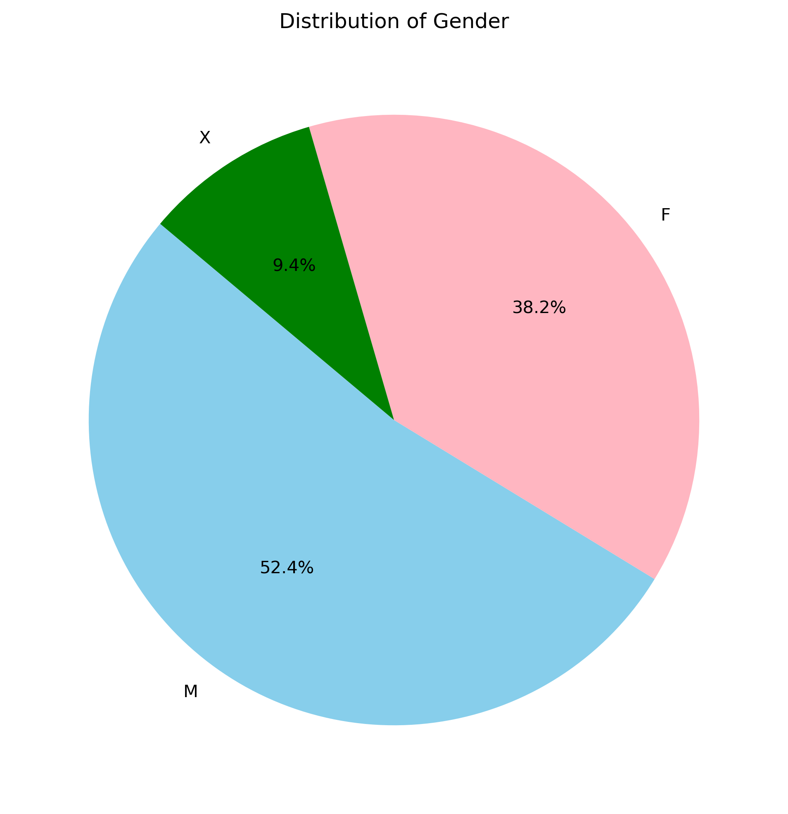
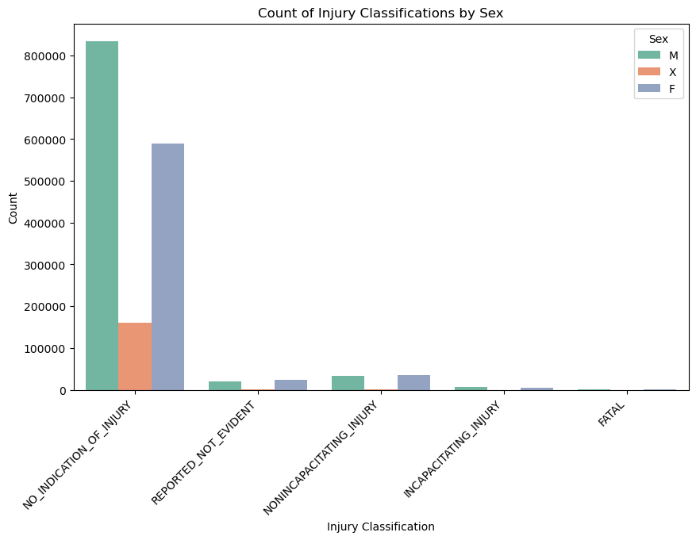
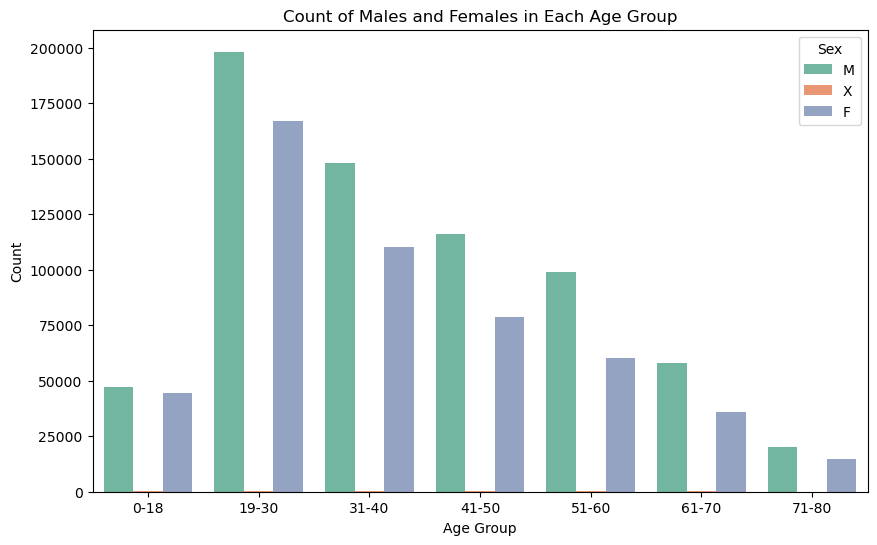
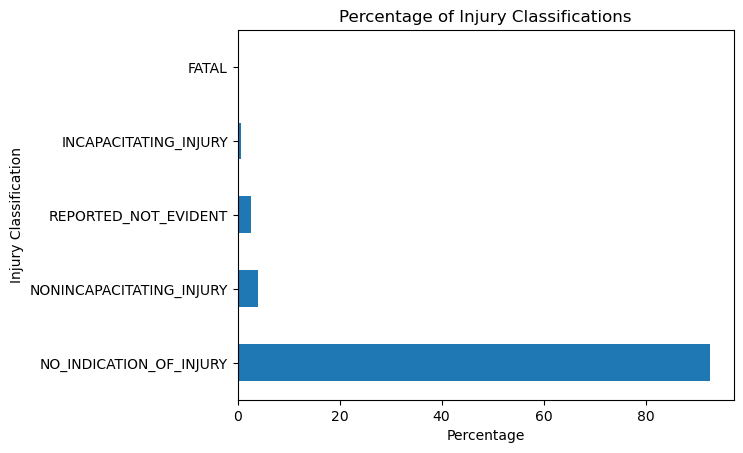
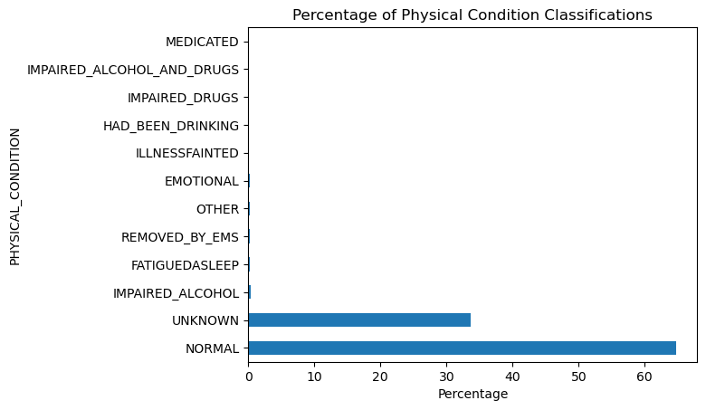

# Predicting the Primary Contributory Cause of Car Accidents

This project aims to develop a predictive model to identify the primary contributory causes of car accidents in the City of Chicago. The project utilizes advanced machine learning techniques, including classification algorithms and feature engineering, to create a robust model that can provide insights into accident causation.

## Objectives

* Systematically explore and clean the Chicago crash datasets to address missing values, outliers, and inconsistencies, ensuring the data is accurate and reliable for modeling. This process will establish a strong foundation for feature selection and model development.

* Identify and engineer the most relevant features that significantly influence crash causes, and reduce dimensionality where necessary to enhance model performance and interpretability. This step ensures the model focuses on the most critical factors, improving predictive accuracy.

* Develop and train a robust multi-class classification model to accurately predict the primary contributory cause of car accidents, experimenting with various algorithms like Random Forest and Logistic Regression to identify the best-performing approach.

* Rigorously evaluate the model’s performance using key metrics such as F1-score, precision, and recall, and optimize it through hyperparameter tuning and cross-validation to ensure it generalizes effectively to new, unseen data.

* Analyze the model’s output to uncover patterns or common factors linked to specific crash causes, providing actionable insights that can guide policy decisions, enhance road safety measures, and shape public awareness campaigns.

* Plan for the model’s integration into a decision-support system, making it accessible to city planners, law enforcement, and public safety officials to aid in strategic planning and proactive accident prevention efforts.

## Data Choice and Understanding

* Due to the large size of the available Crash Data files and limited resources, such as time for running and tuning models, we have decided to use only two datasets from the collection for our modeling efforts. This approach allows us to focus on achieving accurate results within our resource constraints while still leveraging a representative portion of the data. It also allows us to focus on the most relevant data while managing computational efficiency. The column `INJURY_CLASSIFICATION` from the `People` dataset will serve as our `Target variable` in the modelling process.

1. `Traffic_Crashes_-_People_20240824.csv` from  [ Driver/Passenger Data](https://data.cityofchicago.org/Transportation/Traffic-Crashes-People/u6pd-qa9d/about_data): This data contains information about `people` involved in a crash and if `any injuries` were sustained.

2. `Traffic_Crashes_-_Vehicles_20240824.csv` from [ Vehicle Data](https://data.cityofchicago.org/Transportation/Traffic-Crashes-Vehicles/68nd-jvt3/about_data): This dataset contains information about `vehicles` (or units as they are identified in crash reports) involved in a traffic crash. 

## EDA

#### The gender distribution

* Let's check the distribution of gender in the involvement of crashes or accidents.

* The datasets had a larger sample of males involved in accidents compared to other gender with a leading percentage of `52.4%` which is more than half of the dataset.
* The females had a `38.2%` while X a non-binary or gender non-conforming identity had `9.4%`

#### Classification of Injuries by Gender

* This graph shows the imbalance in the classifications with the class `NO_INDICATION_OF_INJURY` getting a large sample and `FATAL` getting the smallest sample.
* From the graph `MALES` have high occurrences in all the five classes followed by `FEMALES`.

#### Age_groups With the Most Accident Occurrences.

 

* From the above graph, the individuals both `males` and `females` between age `19-30` were the most involved in car crashes.
* `Males` in this age group had the highest occurrences with over `180000` crashes while over `170000 Females` in the same age_group of `19-30` had a crash.

#### Injury Clasifications

* From the above graph we can see that the column `INJURY_CLASSIFICATION` has most of the records in the category `NO_INDICATION_OF_INJURY`

#### Classification of Physical Condition

* The `NORMAL` classification had the highest percentage with over 65% which shows that more than 65% crashes people involved were in normal conditions.

## Preprocessing

#### Treating Missing Values

* There were few missing values from the `target` variable and dropping the rows would not have a big impact on our dataset since there are 1391998 rows in our dataset. This was the best approach for the `target` variable in order to avoid `leakage` if we imputed the missing values.
* The dropped rows from our target variable were dropped from our features to maintain alignment between the features and the target variable to avoid incorrect predictions.
* We instantiated a MissingIndicator and fitted it to the train data of our `features` and created a `Helper function` for transforming features.

#### Encoding Categorical Variables

* We created a `helper function` and it takes in the full X dataframe and feature name, makes a one-hot encoder, and returns the encoder as well as the dataframe with that feature transformed into multiple columns of 1s and 0s
* We used encoder = OneHotEncoder(sparse_output = True) and fit it to the training data. Then called our helper function that encoded the feature and concat it.
* We used `LabelEncoder` from `scikit-learn` libraries to encode our target variable. Since this is a Multiclassification model, label encoding is suitable for the target variable because it maps each category to a unique integer, which the model can use directly to predict class labels

#### Feature Selection

* Here we focused only on relevant features to mitigate overfitting and also help improve training time since fewer features mean less data for the model to process.
* Identifying the most important variables helps eliminate noise leading to better performance.
* We identified 6 important features with the highest percentage of coefficients.

###### Important Features

* F (0.977655): This feature, representing the gender category for female, has the highest importance or coefficient. This means that the model considers this feature the most significant when making predictions.

* DEPLOYED_COMBINATION (0.404507): This refers to instances where multiple safety systems, such as both front and side airbags, were deployed together during an accident This feature is the next most important, though significantly less so than "F". It still plays a considerable role in the model's decisions.

* AGE_missing (0.347520): This indicates that missing age data has a moderate influence on the model's predictions.

* REMOVED_BY_EMS (0.299424): This feature also has a moderate impact, suggesting that being removed by EMS is relevant but less so than the previous features.

* DEPLOYED_FRONT (0.095676): The importance of this feature is relatively low, meaning that whether or not the front was deployed has a minor effect on the model's predictions.

* DEPLOYED_SIDE (0.037232): This feature has the least influence, indicating that the side deployment has minimal impact on the model's predictions.

## Modelling

* We started by creating a `dummy model`. After running the cross-validation the dummy classifier results were `[0.92605473, 0.92605806, 0.92605806, 0.92605447, 0.92605447]`. The model seemedto perform well.
* A `DecisionTreeClassifier` with `max_depth=5` was also trained and fit on our training data. Our decisiontree regressor showed a mean accuracy score of `92%` across all folds.
* This means that the model could accurately predict 92% instances in the dataset. The model was either overfitting or biased.

####  LogisticRegression

* We introduced a logistic regression model and fit to our training set.
                         precision    recall  f1-score   support

                   FATAL       0.00      0.00      0.00       125
   INCAPACITATING_INJURY       0.00      0.00      0.00      2281
NONINCAPACITATING_INJURY       0.56      0.03      0.05     14064
 NO_INDICATION_OF_INJURY       0.93      1.00      0.96    322297
    REPORTED_NOT_EVIDENT       0.00      0.00      0.00      9158

                accuracy                           0.93    347925
               macro avg       0.30      0.21      0.20    347925
            weighted avg       0.88      0.93      0.89    347925

* The model recorded an accuracy score of 93%. From the classification report, it shows the model performs very well on the majority class "NO_INDICATION_OF_INJURY" but fails to perform adequately on the minority classes like "FATAL," "INCAPACITATING_INJURY," and others. This suggests that the model is heavily biased towards the majority class.

* We trained another LogisticRegression model with `class_weight='balanced'` to cater for the imbalances, `random_state = 42`, `penalty = 'l2'`, `solver='saga'` and `max_iter = 1000`.
                          precision    recall  f1-score   support

                   FATAL       0.01      0.33      0.01       125
   INCAPACITATING_INJURY       0.04      0.09      0.05      2281
NONINCAPACITATING_INJURY       0.24      0.12      0.16     14064
 NO_INDICATION_OF_INJURY       0.98      0.31      0.47    322297
    REPORTED_NOT_EVIDENT       0.03      0.75      0.06      9158

                accuracy                           0.31    347925
               macro avg       0.26      0.32      0.15    347925
            weighted avg       0.92      0.31      0.44    347925

* The model has improved in detecting minority classes, as seen by the increase in recall for "FATAL," "INCAPACITATING_INJURY," and "REPORTED_NOT_EVIDENT." However, this came at the cost of overall accuracy and precision, especially for the majority class "NO_INDICATION_OF_INJURY." The trade-off indicates a shift from a model that was highly accurate but biased towards the majority class, to one that is more balanced but less precise overall.

#### Scaling

* We went ahead and scaled the features and trained the LogisticRegression model further and evaluated it's performance through the classification report below.

                         precision    recall  f1-score   support

                   FATAL       0.00      0.63      0.00       125
   INCAPACITATING_INJURY       0.01      0.53      0.01      2281
NONINCAPACITATING_INJURY       0.20      0.04      0.07     14064
 NO_INDICATION_OF_INJURY       0.97      0.08      0.14    322297
    REPORTED_NOT_EVIDENT       0.00      0.00      0.00      9158

                accuracy                           0.08    347925
               macro avg       0.24      0.26      0.05    347925
            weighted avg       0.91      0.08      0.14    347925

* After scaling, recall for the minority classes (e.g., "FATAL" and "INCAPACITATING_INJURY") improved significantly. For "FATAL," recall increased from 0.33 to 0.63, and for "INCAPACITATING_INJURY," from 0.09 to 0.53. This suggests that the model is now identifying more instances of these classes. Precision Decrease:

* Precision for these classes dropped to nearly 0, indicating that while the model is identifying more instances, it is also making many incorrect predictions. This leads to very low precision, which is problematic for these minority classes. Performance on Majority Class:

* For "NO_INDICATION_OF_INJURY," both precision and recall dropped significantly after scaling (precision from 0.98 to 0.97, recall from 0.31 to 0.08). This indicates that the model's ability to correctly predict the majority class has deteriorated. Overall Accuracy:

* Accuracy dropped drastically from 0.31 before scaling to 0.08 after scaling. This indicates that the model's overall ability to correctly classify instances has decreased significantly. Macro and Weighted Averages:

* The macro average F1-score decreased from 0.15 to 0.05, and the weighted average F1-score dropped from 0.44 to 0.14 after scaling. This suggests that the model's overall performance across all classes worsened after scaling.

## Conclusion

* Overall, the LogisticRegression model before scaling performed better. The drastic drop in precision, accuracy, and F1-scores after scaling suggests that while scaling helped with identifying minority classes, it did so at a considerable cost to overall model performance. Adjustments like further hyperparameter tuning, or exploring different scaling techniques, might help balance the trade-offs better.
* The feature "F" (indicating gender category for female) is the most influential factor in the model, suggesting that gender plays a significant role in the prediction of crash outcomes. This could imply that gender-related factors are closely associated with the primary causes of crashes and injury severity.
* The features related to airbag deployment (both in combination and individually) indicate that the presence and type of airbag deployment are relevant but less influential than gender. This suggests that the involvement of safety systems like airbags is related to crash severity or type, but other factors may play a more significant role in determining the primary cause.
* The "AGE_missing" feature, which likely indicates whether the age of the involved individuals is missing, also has a notable influence. This could suggest that missing data on age might correlate with specific injury classification or that age itself is an important but underrepresented factor.
* The "REMOVED_BY_EMS" feature indicates whether individuals were removed by EMS at the scene. Its moderate importance suggests that the need for EMS removal is associated with more severe or complex crash scenarios, potentially tied to specific primary causes.

## Recommendation

* The original `LogisticRegression` model is recommended since it takes intoconsideration the dataset’s imbalance. It provides the best performance in terms of stability and accuracy.

* Given the high importance of the `gender feature`, it would be worthwhile to investigate further why gender plays such a significant role. This could involve examining `gender-specific behaviors`, 1`types of vehicles driven`, or other socio-demographic factors that may contribute to crash causation.

* The current model suggests that certain socio-demographic factors (like gender) and response indicators (like EMS involvement) are primary drivers in the predictions. To improve accuracy and interpretability, focusing on `data completeness` and broadening the range of features considered might yield more actionable insights.